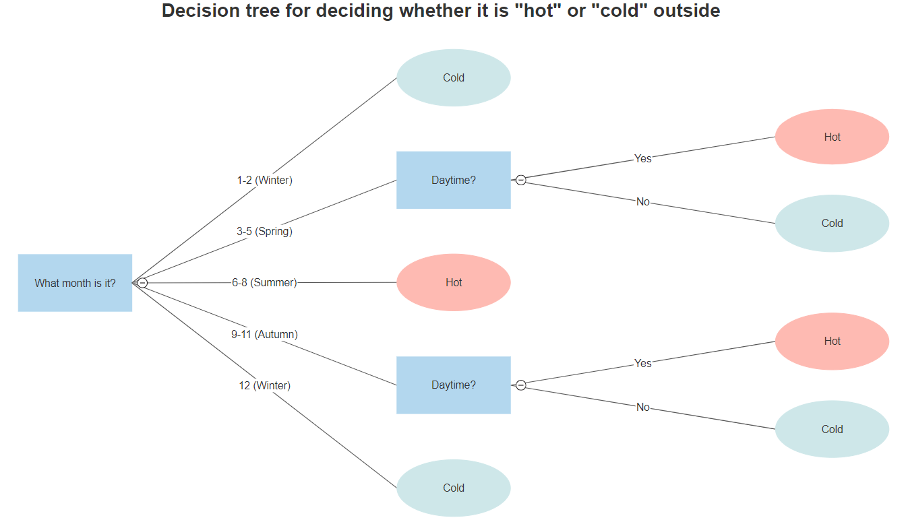
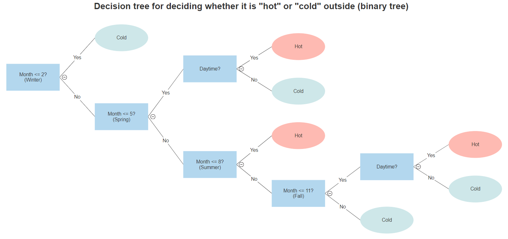
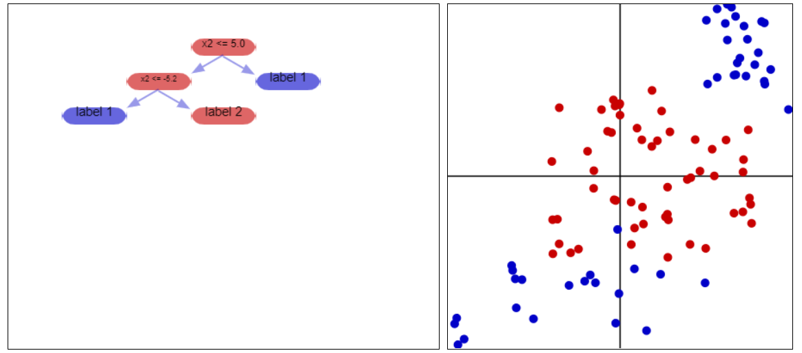
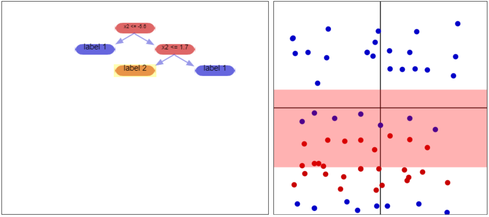
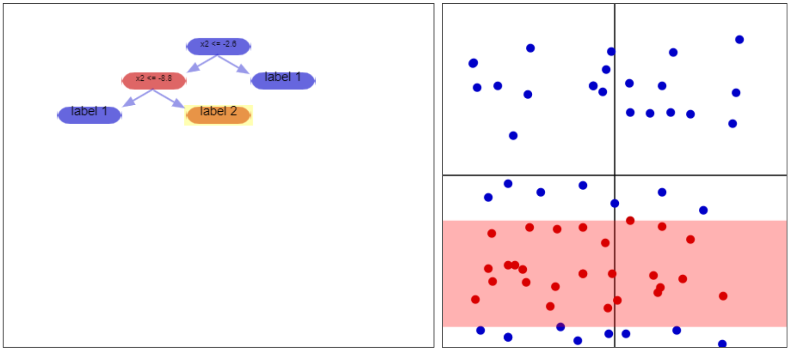

### External Resources
- (Before/During) [Prateek Karkare's _Decision Trees — An Intuitive Introduction_](https://www.kdnuggets.com/2019/02/decision-trees-introduction.html) offers a very good first glance at decision trees. I highly recommend checking it out, especially the first page. You can look at it before reading this page without issue.
- (During/After) [Fabien Lauer's "Decision Tree" Page](https://mlweb.loria.fr/book/en/decisiontree.html) Interactive demo for plotting points/forming a decision tree for classified points in a 2D plane. Also useful for understanding decision trees in the sense of a spatial perspective upon the data being classified, and has pseudocode for training a decision tree.
- (After) [Kilian Weinberger's Decision Tree Lecture Notes](https://www.cs.cornell.edu/courses/cs4780/2018fa/lectures/lecturenote17.html) Goes over purity functions and the ID3 algorithm for determining a decision tree from a dataset using them.

# Decision Trees
## Introduction - "What is a a decision tree?"
Every day you make decisions. What food to get from the grocery store, what to prepare for dinner that night, who to hang out with after after work (and where, when we're not in the middle of a pandemic). Some of these decisions are simple - but for the more complicated ones, how do you break it down? One way of doing so is by breaking a larger decision into a bunch of smaller decisions.

A **decision tree** is a tree used for classifying outcomes - given some set of information, you answer some question by proceeding down the tree, answering smaller questions to guide you along the way.

### Example of a tree

Above, for example, is a (simplified) example of a decision tree for me choosing an apartment. If you select a given apartment, you can follow the tree to determine whether I would classify it as an "apartment I want" or "an apartment I don't want". //Notice that at the beginning of the tree all apartments are feasible - of

### Properties/Terminology
Recall some terminology/properties about trees: the head of a tree is called the "root", the bottoms of the tree are called "leaf nodes/terminal nodes", and the connections between arbitrary nodes in the tree are called "edges". Trees, by definition, only ever proceed from roots to leaf nodes - you don't have any child nodes that have multiple parents, and you don't end up with cycles anywhere in the tree. **In the case of a decision tree, the leaves are events/outcomes, and the edges are decisions**. 

Despite the fact that you'll commonly see decision trees that are binary - that is, trees where every nonterminal node has two children; trees where every node has exactly two possible decisions - decision trees can have as many branches as you want. As an example, consider trying to decide whether a day is "rainy" based on month of the year - the node might break into Late Winter, Spring, Summer, Fall, and Early Winter nodes.

{:height="600px" width="600px" .center-image}

However, all such trees can also be represented as binary trees, like below

{:height="600px" width="600px" .center-image}

### Probability
Recall that the product rule for independent events is that, given two events $$A_1$$ and $$A_2$$, the probability $$P(A_2|A_1)$$ - that is, the probability that $$A_2$$ happens given that $$A_1$$ happens is just $$P(A_2|A_1) = P(A_1)\cdot P(A_2)$$ (the odds of $$A_1$$ happening, then the odds of $$A_2$$ happening). For dependent events, the product rule is $$P(A_2|A_1) = \frac{P(A_1, A_2)}{P(A_2)}$$

In decision trees, we normally care about the events at the leaf nodes (at the bottom of the tree), but we can also talk about the events along the way. In the hot-cold decision tree earlier, for example, we can talk about "Autumn" being an event and "Day" being an event - in that case, the odds of reaching the particular "hot" node that follows from it is just

{:height="600px" width="600px" .center-image}

$$\begin{align*}P(\text{Specific hot leaf node event}) &= P(\text{Autumn}) \cdot P(\text{Day}|\text{Autumn}) \cdot P(\text{Hot}|\text{Autumn}∩\text{Day})\\
&= P(\text{Autumn}) \cdot P(\text{Day}) \cdot 1 = \frac{1}{4} \cdot \frac{1}{2}\end{align*}$${:height="600px" width="600px" .center-image}

### Intuition - partitioning space
Intuitively, we can think of decision trees as partitioning space into a number of sectors. Consider a bunch of vectors in space, and suppose we're trying to figure out their labels. Following along a decision tree, at each node, we come across a decisiwon; that decision splits the vectors in twain. For example, consider the below dataset

{:height="600px" width="600px" .center-image}

This is a collection of vectors in 2D space. The computer does not see the color, however; it just sees numbers (presumably we could just encode the colors, but the idea behind this is to predict vectors we /don't/ know the colors/labels for). The decision tree at the left will (in most cases) guide us towards the correct color, as we shall see.

{:height="600px" width="600px" .center-image}

We are trying to decide if a vector is red or blue. To do this, we consider - "is the y-coordinate less than 5?" This question splits the plane in twain - if the answer is "no" we're in the part of the plane above y=5; if the answer is "yes" we're in the part of the plane below y=5. Each branch from the initial node takes us to one of these two sections. For the sake of consideration, let us consider the case where the answer is "yes, we're below y=5" and move to the branch of the tree corresponding with that answer.

{:height="600px" width="600px" .center-image)

In this next node of the tree, we consider - "is the y-coordinate greater than -5.2"? This question splits the part of the plane we're already considering, so we have two pieces - if the answer is "yes", we're between y=-5.2 and y=5, and we call the vector "red". If it's below y=-5.2, we call the vector "blue".

You might notice that while splitting up the plane in this manner/using a decision tree lets us correctly label /most/ of the vectors, there are extraneous vectors that are misclassified in the process. Creating a decision tree is a balance between /conciseness/ - how many decisions/nodes we have - and /accuracy/ - how many of the labelled vectors are classified correctly. We shall talk about this in a moment when we discuss how _pure_ results of the decision tree are.

## Purity
Cribbing an example from [here](https://discuss.analyticsvidhya.com/t/decision-tree-gini-impurity-purity/37650/3), suppose you have a bar of gold. The purity of this gold bar is what % gold it is - it's 100% pure gold if every atom in it is pure gold, 50% pure gold if only half of it is, and so on. Generalizing this a bit, suppose we had a mixed gold-silver bar of metal and all we cared about was purity - regardless of metal. This bar would be at its most pure at 100% gold, 0% silver, or at 0% gold, 100% silver. It would be at its least pure at 50% gold, 50% silver.

When talking about the results decision trees we care about something similar. If our decision tree has the same answers for a random bunch of vectors, when we reach the end we want most of the vectors to have the same classification. If we throw a bunch of vectors at our tree and they all reach the same leaf node, they should mostly all have the same true classification. Putting it spatially, after our tree partitions space, we ideally want a given partition to have only one "true label" for all of its vectors.

|||
|---|---|
|Example of an impure partition. The leaf node of the tree results in a mixture of red/blue dots - it would be much better if it just had one or the other, since it classifies them all the same way (unless the tree is expanded past this point, so more decisions are made).|Example of a 100% pure partition. All of the vectors here have the same "true" label, red.|

### Using Purity to Generate Trees
Using the concept of purity to generate trees is fairly straightforward. First off, consider some set of training labelled vectors, $$S$$. First off, choose a way to measure purity. To start with, you can imagine this being something like % of vectors in the set belonging to the same class.

**Top-down Induction of a Decision Tree** 
_This algorithm returns a node, as well as potentially children of that node and so on - in other words, it returns a tree_
1. Consider your current, $$S$$ of sample vectors. Take $$S$$'s purity.
2. 
    * If $$S$$ is pure enough, you're done. Just return a node with whatever label most of the cells have _(if you follow the tree to here with a vector, it takes on that label)_.
    * If $$S$$ isn't pure enough, use some method to come up with a decision that divides $$S$$ into subsets $$S_1$$, $$S_2$$, ... so that the average purity across all of the subsets is maximized.
3. Return a node with the decision from the previous step. Run this algorithm on each of the resulting subsets $$S_1$$, $$S_2$$, ... to determine what kinds of nodes they are/ what children they have, if any.

### Types of Purity
#### Entropy
I highly, highly recommend looking at . It offers a very intuitive explanation of what entropy is, and how the equation I'm about to mention arises though.

Suppose you have a set of data points, $$S$$. Suppose that dataset is composed of $$p$$ datapoints of one true label (say, "red"), $$q$$ datapoints of another true label (say, "blue"). Then the (Shannon) **entropy** of $$S$$, $$H(S)$$ is just

$$H(S) = -(p\log_2(p) + q\log_2(q))$$

More generally, suppose $$S$$ comprises a more diverse collection of labels. You might have $$p_1$$ datapoints of one true label, $$p_2$$ datapoints of another true label, $$p_3$$ datapoints that are a third true label... and so on. In this case, the entropy is given as

$$\begin{align*}
H(S) &= -(p_1\log_2(p_1) + p_2\log_2(p_2) + ...)
&= -\displaystyle\sum_i {p_i \log_2(p_i)}
\end{align*}$$

#### GINI Coefficient
## Forests
### Curse of Dimensionality
### Voting
## Random Forest Classifiers
## Acknowledgements
* Interactive 2D dataset taken from Fabien Lauer's "Decision Tree" Page at <https://mlweb.loria.fr/book/en/decisiontree.html>
