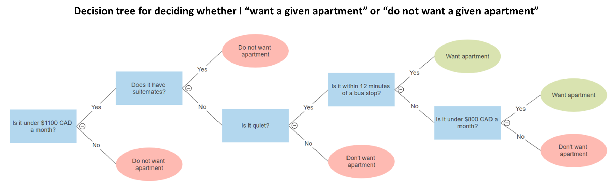

### External Resources
- (Before/During) [Prateek Karkare's _Decision Trees — An Intuitive Introduction_](https://www.kdnuggets.com/2019/02/decision-trees-introduction.html) offers a very good first glance at decision trees. I highly recommend checking it out, especially the first page. You can look at it before reading this page without issue.
- (During/After) [Kilian Weinberger's SVM Lecture Notes](https://www.cs.cornell.edu/courses/cs4780/2018fa/lectures/lecturenote09.html) Interactive demo for plotting points/forming a decision tree for classified points in a 2D plane. Also useful for understanding decision trees in the sense of a spatial perspective upon the data being classified, and has pseudocode for training a decision tree.

# Decision Trees
## Introduction - "What is a a decision tree?"
Every day you make decisions. What food to get from the grocery store, what to prepare for dinner that night, who to hang out with after after work (and where, when we're not in the middle of a pandemic). Some of these decisions are simple - but for the more complicated ones, how do you break it down? One way of doing so is by breaking a larger decision into a bunch of smaller decisions.

Above, for example, is a (simplified) example of a decision tree for me choosing an apartment.
### Terminology
### Example of a tree
### Probability
## Intuition - partitioning space
### Curse of Dimensionality
## Forests
### Voting
## Random Forest Classifiers
