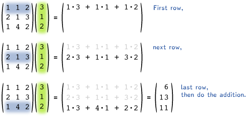

### External Resources
- [Brian Sanderson (3Blue1Brown)'s _Essence of Linear Algebra_ series](https://www.youtube.com/watch?v=fNk_zzaMoSs&list=PLZHQObOWTQDPD3MizzM2xVFitgF8hE_ab&ab_channel=3Blue1Brown) provides a _fantastic_ introduction to linear algebra (and the 15-part series, in totality, covers what a first-year course in the subject would). For this course, remembering the videos' contents is possibly overkill, but you may find that having at least an awareness of their material proves useful. Episodes 1-9 provide a fairly comprehensive overview of linear transformations and dot products.

- ["Foundations of Machine Learning: Linear Algebra"](https://the-learning-machine.com/article/machine-learning/linear-algebra) is your referential pal whenever you need to know more about a linear algebraic terms for this course (as well as for material beyond the scope of this course). It lays out terms and descriptions of them in friendly, easily-digestible chunks, and offers interactive visualizations of a number of them for your convenience.

# Linear Algebra
## Overview
At its core, linear algebra is about two things: representation and transformation. In the context of this course, data is represented as _vectors_ and usually processed by _matrices_. When you multiply a matrix _**M**_ by a column vector **v** (i.e. **_M_**__v__), the rows of the matrix are each multiplied by the vector in an elementwise faction. More explicitly,

or, as a further visual,

## Motivating Example

Now, suppose we're dealing with chocolate-chip cookies, and we want to encode information about the chocolate chips and cookie dough used. We might care about the volume, that is, how many cups\* of each we have. Suppose in our last batch of cookies we used 10 cups of dough and 2 cups of chocolate-chip cookies. We might represent this, then, as

 
Now, suppose you wanted to convert this into metric measurements (because the units are easier and/or you aren't in upper North America). You could accomplish this with the

## Linear Transformations
### What are Linear Transformations?
#### Intuitively
Intuitively, a linear transformation is one that, if applied to a coordinate space, **preserves lines**, **preserves ratios of distances between points**, and that **map the origin to itself**. If any one of these is violated, the transformation is not linear. As an example, any transformation that translates the vector (0, 0) is not linear.
#### Formally
Formally, a linear transformation _T_: *V* ⭢ *W* (where _V_ and _W_ are real vector spaces) is any transformation that satisfies the following two axioms:
|&nbsp;|&nbsp;|&nbsp;|
|---|---|---|
| **Additivity** |  &nbsp;&nbsp;|  |
| **Homogeneity** |  |

### Examples
Below are the fundamental 2D linear transformations/matrices
#### Identity
The identity transformation takes in a vector and spits out the same vector. The matrix is

. 

You might notice that I'm mixing the terms matrix and transformation a bit - the identity matrix is _I_ as given above, and the identity transformation on a vector is just multiplying the matrix by that vector:  (which is just ). 
#### Scaling
Scaling matrices 
#### Reflection
#### Rotation
#### Shearing
###

## Beyond Linear Transformations
FOr this course, 
