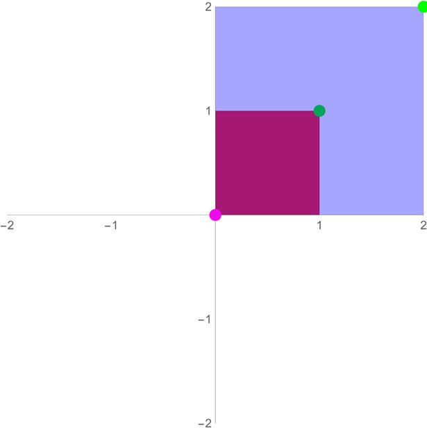

### External Resources
- [Brian Sanderson (3Blue1Brown)'s _Essence of Linear Algebra_ series](https://www.youtube.com/watch?v=fNk_zzaMoSs&list=PLZHQObOWTQDPD3MizzM2xVFitgF8hE_ab&ab_channel=3Blue1Brown) provides a _fantastic_ introduction to linear algebra (and the 15-part series, in totality, covers what a first-year course in the subject would). For this course, remembering the videos' contents is possibly overkill, but you may find that having at least an awareness of their material proves useful. Episodes 1-9 provide a fairly comprehensive overview of linear transformations and dot products.

- ["Foundations of Machine Learning: Linear Algebra"](https://the-learning-machine.com/article/machine-learning/linear-algebra) is your referential pal whenever you need to know more about a linear algebraic terms for this course (as well as for material beyond the scope of this course). It lays out terms and descriptions of them in friendly, easily-digestible chunks, and offers interactive visualizations of a number of them for your convenience.

# Linear Algebra
## Overview
At its core, linear algebra is about two things: representation and transformation. In the context of this course, data is represented as _vectors_ and usually processed by _matrices_. When you multiply a matrix _**M**_ by a column vector **v** (i.e. **_M_**__v__), the rows of the matrix are each multiplied by the vector in an elementwise faction. More explicitly,

$$\boldsymbol{\mathit{M}}\vec{v} = 
\begin{bmatrix}
m_{11} & m_{12} \\
m_{21} & m_{22} \\
m_{31} & m_{32}
\end{bmatrix}
\begin{bmatrix}
v_{a} \\
v_{b} 
\end{bmatrix}=
\begin{bmatrix}
m_{11} \cdot v_a + m_{12} \cdot v_b\\
m_{21} \cdot v_a + m_{22} \cdot v_b\\
m_{31} \cdot v_a + m_{32} \cdot v_b
\end{bmatrix}
$$

or, as a further visual,

### Motivating Example
{:height="225px" width="225px"}

Now, suppose we're dealing with chocolate-chip cookies, and we want to encode information about the chocolate chips and cookie dough used. We might care about the volume, that is, how many Commonwealth cups\* of each we have. Suppose in our last batch of cookies we used 10 cups of dough and 2 cups of chocolate-chip cookies. We might represent this, then, as

$$\vec{v}=\begin{bmatrix}
10 \text{ cups of dough} \\
2 \text{ cups of chocolate chips} \\
\end{bmatrix}$$
 
Now, suppose you wanted to convert this into metric measurements (because the units are easier and/or you aren't in upper North America). You could accomplish this with the following expression:

$$\text{metricized }\vec{v} = \begin{bmatrix}
250 \frac{\text{ml}}{\text{cup}} \cdot 10 \text{ cups of dough}\\
250 \frac{\text{ml}}{\text{cup}} \cdot 2\text{ cups of chocolate chips}\\
\end{bmatrix}=\begin{bmatrix}
2500 \text{ ml of dough}\\
500 \text{ ml of chocolate chips}\\
\end{bmatrix}$$

By using the transformation $$\mathbf{M}_1=\begin{bmatrix}
250 \frac{\text{ml}}{\text{cup}} & 0\\
0  & 250 \frac{\text{ml}}{\text{cup}}\\ 
\end{bmatrix}$$, you can achieve the same result via

$$\begin{align*}
\text{metricized }\vec{v} &= \mathbf{M}_1 \vec{v} \\
&=\begin{bmatrix}
250 \frac{\text{ml}}{\text{cup}} & 0\\
0  & 250 \frac{\text{ml}}{\text{cup}}\\ 
\end{bmatrix}\begin{bmatrix}
10 \text{ ml of dough}\\
2 \text{ ml of chocolate chips}\\
\end{bmatrix}=\begin{bmatrix}
2500 \text{ ml of dough}\\
500 \text{ ml of chocolate chips}\\
\end{bmatrix}
\end{align*}$$

In this way, we can transform data with matrices. You might notice that we transformed each piece individually - that is, the transformed cookie dough amount only relied on the original cookie dough amount, and the transformed chocolate chip amount only relied on the original chocolate chip amount. This is what's known as a _scaling transformation_ - we can do more than that, though.

Suppose Darcy only wants cookies where there is at least > 10% chocolate chips by volume prior to baking, and the more chocolate chips, the better (they are a chocolate chip fanatic). We might come up with a "Darcy score", $$D(\vec{x})$$ that takes in a chocolate chip cookie composition and outputs how much Darcy likes it. In this case, if we wanted positive scores to be "cookies Darcy likes", we could go through the process of

$$\text{need } \vec{x}_{chocolate} > 0.1(\vec{x}_{chocolate} + \vec{x}_{dough}) \\
  \Rightarrow\text{need } \vec{x}_{chocolate} - 0.1(\vec{x}_{chocolate} + \vec{x}_{dough}) > 0 \\
  \Rightarrow\text{need } 0.9\vec{x}_{chocolate} - 0.1\vec{x}_{dough}>0$$

To obtain a Darcy Chocolate Chip Cookie score(TM) of

$$D(\vec{x})=0.9\vec{x}_{chocolate} - 0.1\vec{x}_{dough}$$

This is what's known as a _linear combination_ - the result depends only on adding multiples of the cookie dough and the chocolate chips - and the transformation can be represented in matrix form.

$$\mathbf{D}=\begin{bmatrix}
-0.1 & 0.9\\
\end{bmatrix}$$

And so we have

$$D(\vec{x})= \mathbf{D}\vec{x}$$

We will elaborate on these topics and more in the sections below.

\*Apparently Commonwealth cups and American cups are different? I wonder if I've been preparing food wrong lately :p.
## Linear Combinations
As mentioned previously, **a _linear combination_ is a set of things (usually vectors, in our case) multiplied by constants (scalars) and added together**. Somewhat more formally, a linear combination of vectors (under some vector space) and scalars (constants from some field) is anything of the form

$$a_1 v_1 + a_2 v_2 + ... + a_n v_n$$

Put another way, it's any result of adding scaled things. It gets its name _linear_ because lines result from linear combinations of vectors constrained by equivalence with some scalar.

### Span
Given a collection of vectors, you can combine them in different ways. Think of what you can do with just the vectors (0, 1) and (1, 0) - you can linearly combine them to reach any point in the xy plane.

**Exercise:**

Suppose you are on a grid and at the position $$\begin{bmatrix} 0\\ 0 \end{bmatrix}$$. You are on a journey to Old Man Gauss's house, and have been given a red hoverboard and a blue magic carpet to get there. 

The red hoverboard can move in (possibly fractional or negative) multiples of $$\begin{bmatrix}
3 \\
1 
\end{bmatrix}$$, and the blue magic carpet can move in (possibly fractional or negative) multiples of $$\begin{bmatrix}
1 \\
2 
\end{bmatrix}$$.

Old Man Gauss's house is located at $$\begin{bmatrix}
107 \\
64 
\end{bmatrix}$$.
Can you reach Old Man Gauss's house?

What if Gauss's house is in the sky at $$\begin{bmatrix} 0 & 0 & 20 \end{bmatrix}^\intercal$$ (so right above you), and you have a red hoverboard, a blue magic carpet, and a yellow flying scooter. The red hoverboard can go increments of $$\begin{bmatrix}
3 & 1 & 0 
\end{bmatrix}^\intercal$$, the blue magic carpet can go increments of $$\begin{bmatrix} 1 & 2 & 0 \end{bmatrix}^\intercal$$, and the yellow flying scooter can go increments of $$\begin{bmatrix} 4 & 3 & 0 \end{bmatrix}^\intercal$$. Can you reach Gauss's house in the sky?

(Credit for hoverboard-carpet task goes to <https://doi.org/10.1080/10511970.2012.667516>)

Given a set of vectors $$v_1, v_2, ...$$, the set of points/vectors you can reach through linear combinations is known as the _span_ of $$v_1, v_2, ...$$. More formally, the span of vectors $$v_1, v_2, ...$$ over a field (let's say $$\mathbb{R}$$) is given by

$$\text{span}(v_1, v_2, ...)=\{c_1 v_1 + c_2 v_2 + ...\ \text{such that } c_1, c_2 ... \in \mathbb{R}\}$$

### Basis Vectors
Consider the 2D plane under standard Cartesian coordinates (the xy plane you've used for virtually everything). You can represent every coordinate in that space in terms of an _x_ value and a _y_ value - as multiples of the vectors $$\hat{x}=\begin{bmatrix}1 & 0\end{bmatrix}^\intercal$$ and $$\hat{y}=\begin{bmatrix}0 & 1\end{bmatrix}^\intercal$$. The 2D-plane ($$\mathbb{R}^2$$) is therefore spanned by $$\hat{x}$$ and $$\hat{y}$$, and so $$\{\hat{x}, \hat{y}\}$$ forms a **vector basis** of $$\mathbb{R}^2$$.

It takes at least two vectors to span a 2D space. We say "at least", because there are certain sets of vectors that still won't be able to span the whole space. For example, consider the set of vectors $$\{\vec{v_1}=\begin{bmatrix}0 & 1\end{bmatrix}^\intercal, \vec{v_2}=\begin{bmatrix}0 & 3.5\end{bmatrix}^\intercal\}$$. The span of these vectors is the entire x-axis, but nothing else!

### Linear Dependence/Independence

Here, $$v_2$$ is what's known as **linearly dependent** on $$v_1$$ (and vice-versa). This is because $$v_2$$ is a scalar multiple of $$v_1$$:&nbsp;&nbsp;&nbsp;&nbsp;&nbsp;&nbsp;&nbsp;&nbsp;$$v_2=3.5v_1$$

More generally, a vector $$v_n$$ is linearly dependent on a set of vectors $$\{v_1, v_2, ..., v_{n-1}\}$$ if $$v_n$$ can be expressed as a linear combination of that set of vectors - i.e. there is some set of constants such that

$$v_n = c_1 v_1 + c_2 v_2 + ... + c_{n-1} v_{n-1}$$

For example, given the vectors $$\begin{bmatrix}5 & 2 & 4\end{bmatrix}^\intercal$$, $$\begin{bmatrix}12 & 10 & 18\end{bmatrix}^\intercal$$ and $$\begin{bmatrix}-1.5 & 2 & 3\end{bmatrix}^\intercal$$, the third vector is linearly dependent on the first two because

$$\begin{bmatrix}-1.5 \\ 2 \\ 3\end{bmatrix}=-1.5\begin{bmatrix}5 \\ 2 \\ 4\end{bmatrix}+0.5\begin{bmatrix}12 \\ 10 \\ 18\end{bmatrix}$$

A set of vectors where at least one of the vectors is linearly dependent on the others is known as a linearly dependent set of vectors.

If a vector $$v_n$$ is linearly dependent on other vectors, whether it's included in a set or not doesn't impact those vectors' span. This is because you can combine those other vectors to create $$v_n$$ and use that as your $$v_n$$ - i.e. if you can reach some goal vector by using

$$v_{\text{goal}} = d_1 v_1 + d_2 v_2 + ... + d_{n-1} v_{n-1} + d_n v_n$$

and you have that

$$v_n = c_1 v_1 + c_2 v_2 + ... + c_{n-1} v_{n-1}$$

then you can reach that goal vector via

$$\begin{align*}v_{\text{goal}} = & d_1 v_1 + d_2 v_2 + ... + d_{n-1} v_{n-1} \\
&+d_n (c_1 v_1 + c_2 v_2 + ... + c_{n-1} v_{n-1})\end{align*}$$

Any vector that can't be reached by a set of vectors is said to be **linearly independent** of those vectors. Any set of vectors where none of the vectors can be reached by the others is called a linearly independent set of vectors. Provided you have _n_ linearly independent vectors of drawn from $$\mathbb{R}^n$$, those vectors span $$\mathbb{R}^n$$, and any additional vectors are linearly dependent on those.

## Linear Transformations
### What are Linear Transformations?
#### Intuitively
Intuitively, a linear transformation is one that, if applied to a coordinate space, **preserves lines**, **preserves ratios of distances between points**, and that **map the origin to itself**. If any one of these is violated, the transformation is not linear. As an example, any transformation that translates the vector (0, 0) is not linear.
#### Formally
Formally, a linear transformation _T_: *V* ⭢ *W* (where _V_ and _W_ are real vector spaces) is any transformation that satisfies the following two axioms:
|   |   |   |
|---|---|---|
| **Additivity** | $$L(\vec{v}_1+\vec{v}_2)=L(\vec{v}_1)+L(\vec{v}_2)$$ &nbsp;&nbsp;| $$\forall \vec{v}_1, \vec{v}_2 \in V$$ |
| **Homogeneity** | $$L(r\vec{v})=rL(\vec{v})$$ |$$\forall \vec{v} \in V, r\in \R$$

### Examples
Below are the fundamental 2D linear transformations/matrices
#### Identity
The identity transformation takes in a vector and spits out the same vector. The matrix is

$$I=\begin{bmatrix}
1 & 0 \\
0 & 1 \\
\end{bmatrix}$$. 

You might notice that I'm mixing the terms matrix and transformation a bit - the identity matrix is _I_ as given above, and the identity transformation on a vector is just multiplying the matrix by that vector: $$I(\vec{v})=\begin{bmatrix}
1 & 0 \\
0 & 1 \\
\end{bmatrix}\vec{v}$$ (which is just $$\vec{v}$$). 
#### Scaling, Reflection, Rotation, Shearing, and Projection

  
Scaling

  
$$\begin{bmatrix}x & 0 \\0 & y \\\end{bmatrix}$$

  
{:height="200px" width="200px"}

|&nbsp;|&nbsp;|&nbsp;|&nbsp;|
|--|--|--|--|
|Scaling|$$\begin{bmatrix}x & 0 \\0 & y \\\end{bmatrix}$$| |Scaling matrices scale a vector along the direction of the vector space's basis vectors (the vectors corresponding to the coordinates being used - i.e. (0, 1) and (1,0) in many 2D-cases).|
|Reflection|$$\text{Ref}(\theta)=\begin{bmatrix}x & 0 \\0 & y \\\end{bmatrix}$$| |Reflection mirrors a vector across a line going through the origin. Only reflections across lines going through the origin are linear transformations (although all are affine transforms; more on that later)|

**TODO**

## Beyond Linear Transformations: Affine Transformations
FOr this course, 
