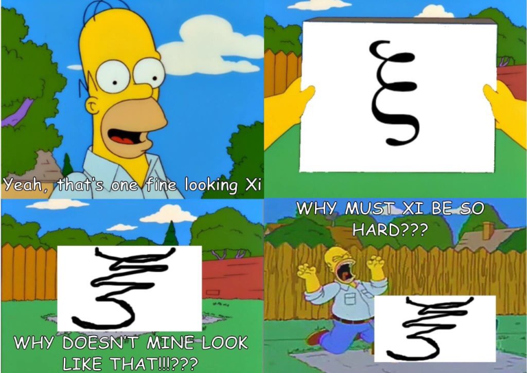

### External Resources
- [Kilian Weinberger's SVM Lecture Notes](https://www.cs.cornell.edu/courses/cs4780/2018fa/lectures/lecturenote09.html) An unequivocally-good, concise, comprehensive look at SVMs. Less gradual than the two resources below, but on the flipside very to-the-point. As far as personal opinions go,  I think it would really have behoven me to have searched a little more and stumbled across this before I got to the editing phase for this article
- [Support Vector Machines (SVM) — An Overview](https://towardsdatascience.com/https-medium-com-pupalerushikesh-svm-f4b42800e989) provides a good overview of SVMs/parameters, as well as a straightforward example of a kernel transformation
- [Support Vector Machines explained with Python examples](https://towardsdatascience.com/support-vector-machines-explained-with-python-examples-cb65e8172c85/) provides a more in-depth exploration of SVMS and some of the math, as well as providing some good Python examples

# Support Vector Machines
## Introduction
The basic premise behind Support Vector Machines (SVMs) is that they provide a **supervised method for finding an efficient binary classifier**. Specifically, given a set of labelled vectors in *n* dimensions, we **find a line/plane** (linear equation) in *n*-1 dimensions **that best partitions our vectors**.

We will start by talking about maximum/hard-margin SVMs, used for data that is linearly separable, i.e. that can be split by a line. A more comprehensive introduction to linear separability can be found under [Linear Classifiers](https://dem1995.github.io/machine-learning/curriculum/linear_classifiers/linear_classifiers_overview.html#external-resources), if desired. We will then talk about an extension of them that can be used for non-linearly-separable data.

## Maximum-margin SVMs
### Motivating Example
To give an example, we might have red (square) vectors and blue (circle) vectors, and desire a simple way of determining what's what. The green line/hyperplane in the below image splits them in twain, and we can thus **derive an expression** that **takes in a vector** and **results in different labels** - negative values on one side of the line and positive values on the other.

For example, one might imagine the equation of the line here is some  - in that case, we can let our classifier function be , resulting in -1 for vectors below the line and +1 for vectors above the line. 

### Choice-of-Hyperplane Intuition
In the previous example, the demonstrated line actually is the result of running a support vector machine. But why that line? Consider the example again, at left, and the figure at right.

 

All of these green lines separate the vectors properly, and indeed could all be used to generate equations for determining the vectors. The line on the left, though, maximizes the distance to the closest sample in each class, and so **typically generalizes best to out-of-sample data**. 

Sure, we could have some wonky underlying distribution, such as where the circles actually appear really close to the squares (or even within the cavity of the squares), but with the information we _know_ (i.e. our collection of samples) additional justification would be needed for choosing anything but this line.

Looking at the line again, we've highlighted the closest vectors, known as the **_support vectors_** as well as indicated what we mean when we say "maximizing the distance to the closest sample in each class", also known as the **_margin_**.

### Support Vector Intuition
Notice that, as the optimal hyperplane is that which separates the classes and maximizes the margin to the closest vectors (aka the support vectors), **the optimal hyperplane is entirely defined by the support vectors**. The support vectors are alternatively given as the collection of vectors that **lie on the margin boundary** (take a moment to convince yourself that these are the same).

### Maximum-margin Hyperplane Equation
The maximum-margin hyperplane equations out there can seem a little opaque, so we'll build it up intuitively. Recall that our goal is to select a line/plane that maximizes the margin about it, that is, a line/plane that is the furthest from any of the datapoints subject to separating them. The format for the equation for this, then, is

For the purposes of the equation, we formalize our set of inputs-output pairs as , where  and (giving the output labels values of -1 and 1 for the sake of computation) . 

Finding the maximum-margin hyperplane described by some line/plane  then becomes

The problem of finding which then boils down through some very nontrivial simplifications to

## Soft-Margin SVMs (for non-linearly-separable data)
Not all data is linearly separable, however. **For data that isn't linearly-separable, maximizing the margin does not necessarily minimize the error**. To accommodate for this, soft-margin SVMs use what's called a **slack parameter**, _**C**_, that can be tweaked to prioritize how much we want to **_maximize the margin_ versus how much we want to _minimize the error_**.

Now, you might be asking at this point what the meaning of a margin even is if there's no separating hyperplane. To address this, we use the equation we derived earlier as a description of "maximum margin"-ness and penalize the result using the error by a factor of *C*.

### Soft-Margin Hyperplane Equation

Okay, so I lied a little bit by virtue of neglecting to mention ξ. However, letting *C* ≥ 0, you can ignore ξ (minor COVID-19 perk- I don't need to write this for you all on a whiteboard*) and convert this into

Which then can be written as

*
