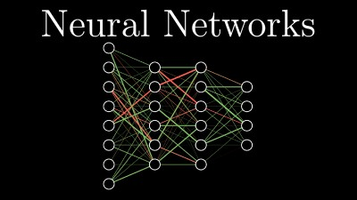
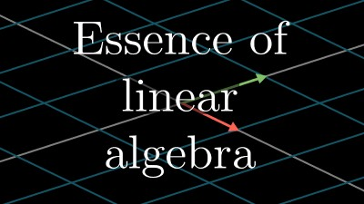

# External Resources
## Video Resources
### 3Blue1Brown (Brian Sanderson)'s Neural Network series
Brian Sanderson (better known as 3Blue1Brown) has a fantastic four-video series on Neural Networks that covers the mathematics behind basic NNs, including gradients and backpropogation.
The first video in the series by itself offers a really good overview of how Neural Networks function as well, however.

### 3Blue1Brown (Brian Sanderson)'s _Essence of Linear Algebra_ series
Videos 1-9 and 13 of Brian Sanderson's _Essence of Linear Algebra_ series provide powerful intuition for understanding matrix transformations on a deeper level, and for interpreting linear regression more comprehensively.
Remembering all of these videos' contents is possibly overkill, but having some level of awareness of the concepts discussed in them can make your life easier.

## PDF Resources
### Professor Martha White's _Machine Learning Handbook_
[Link to Martha White's _Machine Learning Handbook_](https://marthawhite.github.io/mlcourse/notes.pdf)

Martha has compiled what is essentially a free textbook on machine learning from when she taught/for when she teaches the course.
The textbook opens with a fairly rigorous treatment of probability, then talks about optimization and parameters. It formulates essential ML questions in the form of regression questions, and concludes by talking about neural networks and evaluation methods.

## Libraries
### Python3/SKLearn
If you're a Python programmer, [SciKit-Learn](https://scikit-learn.org/stable/index.html/) offers a pretty good number of configurable algorithms and tools for analyzing results with them, as well as descriptions of how the algorithms work/how to use them.

Installation: a Pip package is available. To install, run `pip install -U scikit-learn`
### C#/Accord.NET
If you prefer C#, [Accord.NET](http://accord-framework.net/) is a powerful option. It sports a number of configurable algorithms, as well as descriptions of how the algorithms work and how to use them.

Installation: a nuget package is available. To install, run `Install-Package Accord -Version 3.8.0` with Package Manager or `dotnet add package Accord --version 3.8.0` through the .NET command-line interface
### R/
