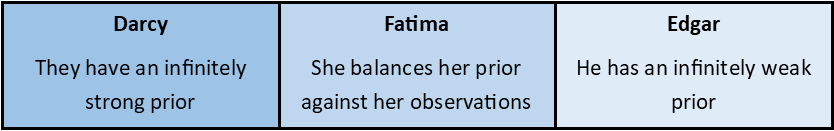
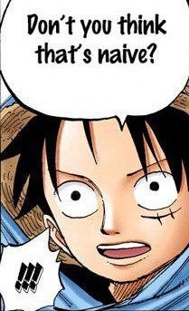

# Bayes's Theorem & Naïve Bayes Classifiers
{: .d-flex	.flex-justify-around}
## Bayes's Theorem
### Introduction
When dealing with probability, you're used to making decisions from observing the world around you - how often each side lands face-up on a die, what the proportion of weather you see outside each day, how long a piece of fruit lasts before going bad - but what happens, if, say, you have 5 rolls of a fair die that have happened to all land on '6'?

_Bayes's theorem_ is a way of reconciling some existing understanding of the world - a _prior belief_ - with some observations - _evidence_ - to form more nuanced predictions - a _posterior belief_. Before digging into these terms, let's motivate this a bit with a story.

### Motivation
A group of three friends - Darcy, Edgar, and Fatima -  are at a carnival (in the good timeline, where we're not dealing with a pandemic). A woman comes up to them and tells them she's clairvoyant (she can see things with her mind's eye), and wants to demonstrate it to them by predicting cards of theirs. All three friends are willing to take her up on it - it's good fun, after all!

The woman takes things more seriously than any of them expect, though, and by the end of her preparing and showing precautions they're convinced there's no way she's hiding anything- she's even using the deck Edgar had on him!

The woman deals a card out to each of you, and guesses a 3 of ♥ (hearts), a 5 of ♦ (diamonds), and a jack of ♣ (clubs). Sure enough, these are precisely the cards that Darcy, Edgar, and Fatima are holding! The three tip her generously for her time and convene at a bar to discuss what they just saw.

Now, Darcy, Edgar, and Fatima have had conversations a number of times, and certain trends have popped up.

* Darcy tends to have a very reserved view of the world- they have very strong prior opinions, and casual events don't tend to change those.
 
Before these events, Darcy _knows, with 100% certainty_ "clairvoyance isn't a thing". Darcy's thoughts going into this are what's called their prior, for them, it's effectively infinitely strong. Darcy's prior before seeing this is $$p(\text{"The carnival-woman is clairvoyant})\approx 0$$, and that remains unchanged after her display.
 
* Edgar, on the other hand, has a _very_ open mind - he takes on new viewpoints extremely readily.

Before these events, Edgar believes that "clairvoyance isn't a thing"- but Edgar's opinions flow with the wind and whatever he sees. He effectively has no prior, and takes whatever he sees at face-value - and he just saw someone demonstrate clairvoyance 3/3 times, meaning he 100% believes she was a clairvoyant.

* Finally, Fatima takes a more balanced approach - she has a strong prior, but is open to changing it.

Before these events, Fatima believes that "clairvoyance isn't a thing" - however, with evidence, she's open to the idea the woman /might/ be clairvoyant. Her prior is strong - $$p(\text{The carnival-woman is clairvoyant}) = 1/1000)$$. Unlike Darcy, however, she updates her prior here-

$$
\begin{align*}
&p(\text{The carnival-woman is clairvoyant} | \text{3 right}) \\
&= \frac{p(\text{3 right} | \text{The carnival-woman is clairvoyant}) \cdot p(\text{The carnival-woman is clairvoyant})}{p(\text{3 right})}\\
                                                 &= \frac{1 \cdot \frac{1}{1000}}{p(\text{3 right} | \text{...clairoyant})\cdot p(\text{...clairvoyant}) + p(\text{3 right} | \text{...clairoyant}) \cdot p(\neg\text{...clairvoyant)}}\\
                                                 &= \frac{1 \cdot \frac{1}{1000}}{1 \cdot \frac{1}{1000} + \frac{999}{1000}\frac{1}{52}^{3}}\\
                                                 &\approx \frac{1}{999} 
\end{align*}
$$

Fatima obviously had a very strong prior here, but the point is that her viewpoint lies somewhere between Darcy's and Edgar's - she used what she knew before-hand and incorporated her new observations to judge the situation. This is what's known as _Bayesian_ thinking - combining thoughts about some underlying distribution about how the world is set up and incorporating new observations into that expected framework.

### Equation
As mentioned before, _Bayes's theorem_ is a way of reconciling some existing understanding of the world - a _prior belief_ - with some observations - _evidence_ - to form more nuanced predictions - a _posterior belief_.

We're interested in what the probability of some outcome _A_ is given the evidence _B_ we're seeing - to find this, we multipy our _prior_ belief of the outcome A _by the likelihood of the evidence_ B we're seeing if we assume the outcome _A_ is the case. The division by the probability of our evidence _B_ occurring is relevant for obtaining our actual posterior probability (our prediction), but as we shall see in a bit, for some applications is largely irrelevant.
## Naïve Bayes Classifier
### Classifier
Deriving a classifier from _Bayes's theorem_ is pretty straightforward - we have a formula for figuring out the probability of some outcome occurring given our evidence, so what's the outcome with the highest probability? Formally, for some evidence _B_, this looks like

$$
\begin{align*}
\text{Bayes_Classifier}(B) &=  \underset{A \in \text{outcomes}}{\operatorname{argmax}}{P(A|B)} \\
                           &=  \underset{A \in \text{outcomes}}{\operatorname{argmax}}{\frac{P(B|A)\cdot P(A)}{P(B)}}
\end{align*}
$$

And this works! Realistically, however, we might have no idea about things like $$P(B|A)$$, and it would be nice if we could lop off a few other pieces. Fortunately, we can!
### Naïve Bayes
So one of the issues we'll typically have is that different pieces of evidence might not be independent - for example, if $$B$$ is a vector containing information about whether it's raining out and how cold it is out, those two things are related! As such, $$P(\text{raining} \cap \text{warm} | A)$$ would be $$P(\text{raining} | \text{warm} \text{ and } A) \cdot P(\text{warm} \text{ and } A)$$ rather than being something more friendly like $$P(\text{raining} \cap \text{warm} | A) = P(\text{raining} | A) \cdot P(\text{warm} | A)$$ - you can imagine how this would get worse and worse the more evidentiary observations we have.

So what's the solution? The solution is, succinctly - _pretend we can assume independence_. 

This might sound dumb (and it kinda is), but as it turns out most of the time this is a fairly good guess. When working with more important things we might want to run some more tests to verify that we can do this, of course, but in many cases this effectively lets us write Bayes's rule for arbitrarily many evidentiary observations $$B_1$$, $$B_2$$, ..., $$B_n$$ as 

$$P(A|B) =  {\operatorname{argmax}} {\frac{ (\prod_i^{n}P(B_i|A))\cdot P(A) }{ P(B) }$$

and so our classifier as

$$
\begin{align*}
\text{Bayes_Classifier}(B) &=  \underset{A \in \text{outcomes}}{\operatorname{argmax}}{P(A|B)} \\
                           &=  \underset{A \in \text{outcomes}}{\operatorname{argmax}}{\frac{(\prod_i^{n}P(B_i|A))\cdot P(A)}{P(B)}
}
\end{align*}
$$

This assumption of independence is what's known as _Naïve Bayes_.

We're just about done - we can use this for our classifiers, in fact! We can take things _one_ more step further though.

### The normalization term is irrelevant
Consider the term in the denominator of Bayes's theorem, the probability of our evidence _B_, $$P(B)$$ (also called the normalization term). This depends _solely_ on the evidence we've observed. Now, consider that for our classifier we're just looking at different outcomes, which are $$A$$s, and trying to see which of these is maximized.

But wait! When considering different outcomes, the evidence isn't changing at all, which means $$P(B)$$ is constant when we're just looking at a single vector of evidence! Since our evidence isn't changing, and since therefore $$P(B)$$ isn't changing, when looking at some evidence and trying to decide which of the $$A$$s is most likely, we can get rid of $$P(B)$$ and that'll change everything by a constant - meaning the outcome $$A$$ that would be most likely will still be the most likely.

In this manner, we arrive at our final Naïve Bayes Classifier equation:

$$
\begin{align*}
\text{Bayes_Classifier}(B) &=  \underset{A \in \text{outcomes}}{\operatorname{argmax}}{P(A|B)} \\
                           &=  \underset{A \in \text{outcomes}}{\operatorname{argmax}}{(\prod_i^{n}P(B_i|A))\cdot P(A)
}
\end{align*}
$$

# Acknowledgements
Credit to Dr. Robert Kübler at [A Gentle Introduction to Bayesian Inference](https://towardsdatascience.com/a-gentle-introduction-to-bayesian-inference-6a7552e313cb) for the carnival/funfair setting for explaining Bayesian thinking.

Credit for Neon Bayes Theorem image to Matt Buck via a pinterest page - <https://www.flickr.com/photos/mattbuck007/3676624894>. The image was taken at Autonomy in Cambridge.

Credit for Luffy D. Monkey goes to Eiichiro Oda and his work, _One Piece_

Credit for other images goes to the web builder, Dawn Estes McKnight

